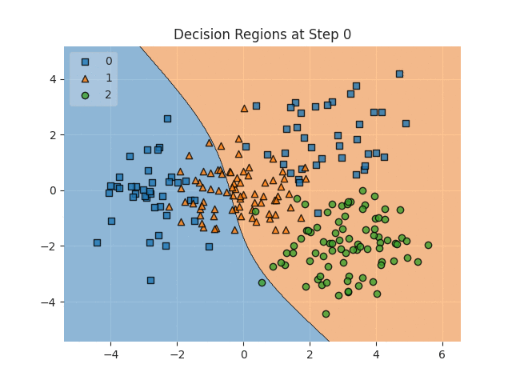

# Blood Cell Classification using a custom MLP approach

This project aims to classify blood cell types using various machine learning models, with a particular focus on the implementation and optimization of a custom Multi-Layer Perceptron (MLP) classifier.

What is a Multi Layer Perceptron? see [here](https://www.youtube.com/watch?v=7YaqzpitBXw&t)

---

Decision regions for a simple dataset with 3 classes visualized over 130'000 steps until convergence (Train Accuracy: 1.0)

---

My implementation [here](Analysis_and_MLP.ipynb)

## Table of Contents

- [Introduction](#introduction)
- [Data Analysis](#data-analysis)
- [Preprocessing](#preprocessing)
- [Model Implementation](#model-implementation)
- [Results and Discussion](#results-and-discussion)
- [Conclusion](#conclusion)
- [GIF Illustration](#gif-illustration)

## Introduction

The goal of this project is to accurately classify different types of blood cells using machine learning techniques. The project includes the implementation of several models, such as Random Forest, Support Vector Machine (SVM), and Multi-Layer Perceptron (MLP), with a detailed focus on a custom MLP classifier i built.

## Data Analysis

The initial step of the project involved a thorough analysis of the dataset, which consists of various features representing the characteristics of different blood cell types. The key steps in the data analysis phase were:

- **Exploratory Data Analysis (EDA):** Visualizing the distributions of features, checking for missing values, and understanding the overall structure of the data.
- **Correlation Analysis:** Identifying relationships between different features to inform feature selection and engineering.
- **Class Distribution:** Analyzing the distribution of different blood cell types to address class imbalances.

## Preprocessing

To prepare the data for modeling, several preprocessing steps were applied:

- **Feature Scaling:** Using `RobustScaler` to handle outliers and bring the data to similar value ranges.
- **Outlier Removal:** Implementing and applying a function to remove outliers per class by calculating Z-scores and removing values that exceed a certain threshold.
- **One-Hot Encoding:** Encoding the target variables using one-hot encoding to prepare them for modeling.

## Model Implementation

### Random Forest Classifier

- **Parameter Tuning:** Performed grid search to optimize hyperparameters.
- **Performance Metrics:** Evaluated using weighted F1-score, unweighted F1-score, and accuracy.

### Support Vector Machine (SVM)

- **Parameter Tuning:** Conducted grid search for optimal hyperparameters.
- **Performance Metrics:** Evaluated and compared with other models.

### Multi-Layer Perceptron (MLP) Classifier

#### Custom MLP Implementation

- **Architecture:** Designed a custom MLP with configurable architecture, regularization, learning rate, and batch size.
- **Cost Function:** Minimized a cross-entropy cost function with regularization.
- **Training:** Used backpropagation for training and vectorized operations for efficiency.
- **Optimization:** Manually optimized hyperparameters to achieve the best performance.

#### Sklearn MLP

- **Comparison:** Implemented the MLP classifier from sklearn for comparison with the custom MLP model.
- **Parameter Tuning:** Grid search for optimal parameters.

## Results and Discussion

The performance of each model was evaluated and compared based on the following metrics:

- **Weighted F1-Score**
- **Unweighted F1-Score**
- **Accuracy**

**Random Forest:** Showed robust performance with high accuracy and F1-scores but slightly lower than SVM and custom MLP.

**SVM:** Achieved the best results across all metrics, demonstrating its effectiveness for this classification task.

**Custom MLP:** Performed very well, slightly behind SVM but better than the sklearn MLP. This indicates the potential of custom implementations for tailored optimizations.

**Sklearn MLP:** Showed good results but was slightly outperformed by the custom MLP and SVM.

## Conclusion

The analysis shows that SVM and the custom MLP model deliver the best performance in terms of accuracy and F1-scores. While Random Forest and sklearn MLP are also very capable, logistic regression performs acceptably as a baseline model. The dummy models serve as useful benchmarks to highlight the superiority of the trained models.

The custom MLP model could be further optimized with more computational power and time, potentially outperforming all other models.

